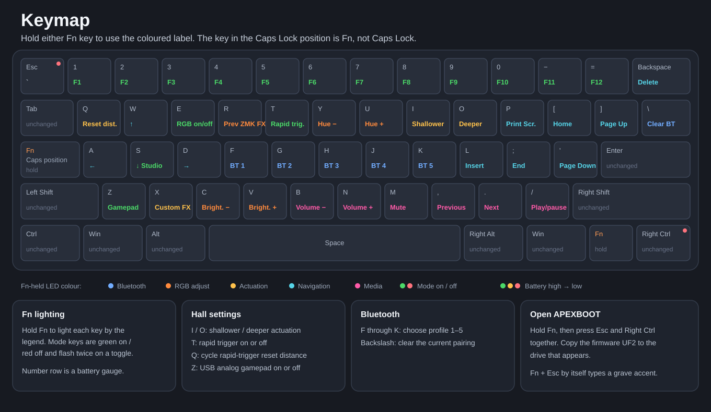

# ZMK firmware for the first-generation SteelSeries Apex Pro Mini Wireless

This firmware is for the first-generation Apex Pro Mini Wireless. It replaces
the firmware on the nRF52833 while keeping the stock STM32 key scanner and its
calibration. Later keyboard revisions have not been tested and may use different
hardware.

This is an independent community project. It is not affiliated with or endorsed
by SteelSeries.

## Downloads

Download the ready-to-flash files from the
[latest release](https://github.com/Ripthulhu/steelseries-apex-pro-mini-wl-zmk/releases/latest):

- `apex-pro-mini-wl-ab.uf2` is the recommended file for updating a keyboard
  that already runs this firmware.
- `apex-pro-mini-wl-ab.zip` contains the project files used for a first
  installation or repair: firmware, bootloader, checksum checker, and programmer
  configurations.

`RELEASE-SHA256SUMS.txt` contains the download hashes.

## First installation

The first installation erases the original firmware from the Nordic nRF52833.
We do not have a complete copy of that firmware, so the Nordic side cannot
currently be restored to stock. The separate STM32 scanner is not erased or
programmed.

### SWD

The tested method uses the SWD pads under the space bar. Removing the keycap is
enough to reach them. Raspberry Pi 4 GPIO is tested. OpenOCD configs for a Pico,
ST-Link, and J-Link are included as well. A Pico acts as a USB debug probe; the
OpenOCD command runs on the computer connected to it.

See [First installation](docs/INSTALL.md) for the pinout and OpenOCD commands.

### USB installer — untested

There is also an [experimental USB installer](installer/README.md) that sends a
migration image through the SteelSeries update protocol and replaces the stock
bootloader with `APEXBOOT`. It has passed offline checks and the bootloader-copy
stage was exercised through SWD, but the complete USB route has never been run
on an untouched keyboard.

The factory bootloader cannot be recovered, so the development keyboard cannot
be returned to stock for that test. See
[Restoring stock](docs/BOOTLOADER.md#restoring-stock) for the reason. You can try
the USB installer, but connect and test SWD first so you can recover the keyboard
if it fails.

## Updating an installed keyboard

After the first installation, updates are simple:

1. Hold `Fn` + `Right Ctrl` + `Esc`.
2. Wait for the `APEXBOOT` drive.
3. Copy the downloaded `apex-pro-mini-wl-ab.uf2` to that drive. If you downloaded
   the ZIP instead, copy the `apex-zmk.uf2` inside it.

The keyboard installs the file and restarts itself. See
[Updating and recovery](docs/FLASHING.md) for the less common alternatives.

## What works

- **USB and Bluetooth:** keyboard input, media controls, the Fn layer,
  adjustable Hall-effect actuation, rapid trigger, per-key RGB, saved settings,
  and Bluetooth pairing have been tested on the keyboard. ZMK Studio works over
  USB.
- **No battery required on USB:** this firmware boots and works with the battery
  physically disconnected. The stock firmware refuses to start in that state.
- **SteelSeries 2.4 GHz receiver:** not implemented. That switch position works
  only while the keyboard is connected over USB.
- **USB analog gamepad:** tested, but games may need their input mapping changed.
  Some games will not work well with it and may require a mod.

Every release stores a recovery copy in external flash. After three unhealthy
boots, the bootloader restores it; the full sequence is described under
[A/B recovery](docs/FEATURES.md#ab-recovery).

## Keymap



The key in the Caps Lock position is a second Fn key; Caps Lock is not assigned.
See the [full-size keymap](docs/KEYMAP.md) for the binding source and update-mode
combo.

## Hardware

- **nRF52833:** USB, Bluetooth, key bindings, lighting, settings, and updates.
  This project replaces its firmware.
- **STM32G0:** Hall-effect measurements and factory calibration. Its firmware is
  unchanged.

The board also has an RGB driver, SPI flash, and battery charger. See
[Hardware](docs/HARDWARE.md) for the part numbers and connections.

## Wireless behavior

With USB power disconnected and the switch in Bluetooth mode, scanning slows
down while the keyboard is idle and returns to full speed as soon as a key
changes. RGB begins fading after 30 seconds without a key event and then shuts
down fully. A USB data connection keeps the scanner at full speed and prevents
the RGB idle timeout.

With the switch in the Bluetooth position, connecting the keyboard to a computer
temporarily moves input to USB. Unplugging it returns to Bluetooth. A charger or
battery bank does not interrupt Bluetooth; RGB can still time out, while the
scanner remains at full speed because VBUS is present.

## Building from source

Install Git and Python 3.10 or newer. Use whichever command starts Python 3 on
your computer (`python` or `python3`), then run:

```sh
python tools/setup_workspace.py
python tools/build_release.py
```

The first command downloads the locked source versions and compiler. Allow about
10 GB of free space; setup only needs to be done once. The second command builds
and checks the application, bootloader, and release bundle. The ready UF2,
complete ZIP, and their checksums are written to `../work/release`; the ZIP is
also left unpacked in `../work/release/apex-pro-mini-wl-ab`.

See [Building from source](docs/BUILDING.md) for setup and common problems. The
[configuration guide](docs/CONFIGURATION.md) covers the settings intended for
local builds.

## Repository layout

| Path | Purpose |
|---|---|
| [`apex-zmk-g4b/`](apex-zmk-g4b/) | Keyboard drivers and firmware configuration |
| [`apex-zmk-slot/`](apex-zmk-slot/) | Board definition, key bindings, and key positions |
| [`bootloader/`](bootloader/) | Code that provides the `APEXBOOT` update drive |
| [`installer/`](installer/) | Experimental USB installer; get SWD working before trying it |
| [`hardware/`](hardware/) | Board photographs, measurements, and pinout notes |
| [`tools/`](tools/) | Build checks and programmer configuration files |
| [`docs/`](docs/) | Installation, repair, and technical reference |

Generated firmware, dependencies, private backups, SteelSeries firmware, and
per-device calibration data are not committed.

## Documentation

- [First installation](docs/INSTALL.md)
- [Experimental USB installer](installer/README.md)
- [Updating and recovery](docs/FLASHING.md)
- [Repairing a keyboard with a programmer](docs/SWD_RECOVERY.md)
- [Building from source](docs/BUILDING.md)
- [Configuration](docs/CONFIGURATION.md)
- [Hardware](docs/HARDWARE.md)
- [Firmware internals](docs/FIRMWARE.md)
- [Features and power use](docs/FEATURES.md)
- [Keymap](docs/KEYMAP.md)
- [How the two processors communicate](docs/PROTOCOL.md)
- [SteelSeries source repositories](docs/STEELSERIES_SOURCES.md)

Project-authored code is licensed under the [MIT License](LICENSE). Imported or
adapted code retains its upstream license; see
[Third-party notices](THIRD_PARTY_NOTICES.md).
