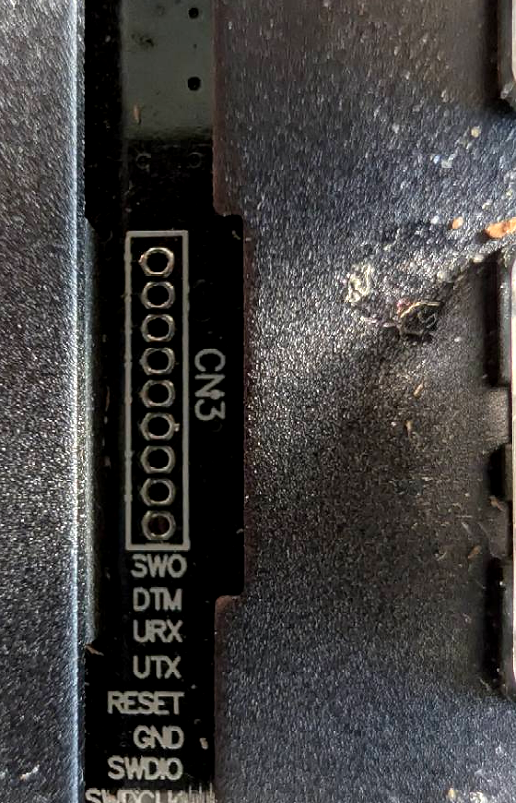
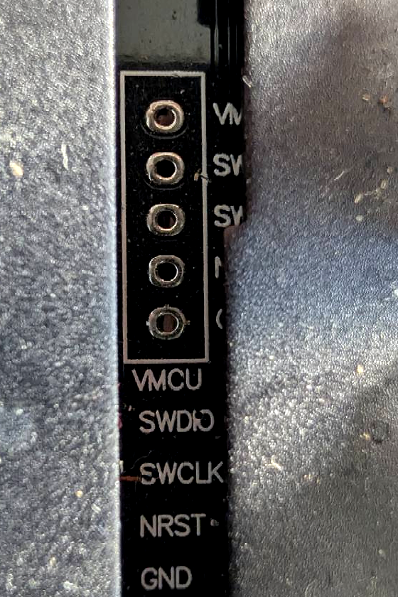

# First installation

This is the first-flash guide for a first-generation Apex Pro Mini Wireless
running the SteelSeries firmware. Later revisions have not been tested. Before
flashing, check that the keyboard has the nine-pad `CN3` header and the exact pad
labels shown below. Stop if they differ.

The SWD pads are under the space bar and can be reached without opening the
case. Later updates use the `APEXBOOT` USB drive.

## Read this before starting

SteelSeries enabled read protection on the nRF52833. It prevents copying the
factory bootloader over SWD, and the available SteelSeries updater files do not
contain it. Unlocking the chip erases its flash, including the original firmware,
so a complete stock restore is not currently possible. The technical details are
in [Restoring stock](BOOTLOADER.md#restoring-stock).

The STM32 processor that measures the keys is separate. This procedure does not
erase it, program it, or change its factory calibration.

## Choose an installation method

The instructions below use SWD. This is the method used on the development
keyboard.

The [experimental USB installer](../installer/README.md) instead sends a
migration image through the stock SteelSeries update protocol. It installs the
Adafruit-based `APEXBOOT` bootloader without attaching a programmer or unlocking
the Nordic through SWD. The complete route has not been tested on an untouched
keyboard, and the development keyboard cannot be returned to stock to reproduce
that starting point.

You can try the USB installer, but first complete the connection check in
[Test the wiring without erasing anything](#test-the-wiring-without-erasing-anything).
That confirms you have a recovery path if the USB migration fails.

## Parts and files

- a keycap puller;
- three short wires or spring-loaded pogo pins; J-Link may need a fourth wire
  for voltage sensing;
- one of the programmer options below: Raspberry Pi 4, Raspberry Pi Pico,
  ST-Link, or J-Link;
- a second USB cable to power the keyboard;
- Python 3 and OpenOCD on the computer controlling the programmer;
- and the `apex-pro-mini-wl-ab` release folder.

SWD is the two-wire programming connection used by these devices. The
programmer connects the computer to the keyboard's `SWDIO`, `SWDCLK`, and
`GND` pads.

OpenOCD runs on a computer. A Raspberry Pi 4 can run OpenOCD and drive SWD from
its GPIO pins. A Pico, ST-Link, or J-Link plugs into a computer over USB and
acts as the SWD adapter. The Pico does not run the flashing command.

Download `apex-pro-mini-wl-ab.zip` from the
[latest release](https://github.com/Ripthulhu/steelseries-apex-pro-mini-wl-zmk/releases/latest)
and extract it. Do not download GitHub's automatically generated “Source code”
archive; that contains the project source, not ready-to-flash firmware.

If you are developing the firmware, [Building from source](BUILDING.md) creates
the same release folder locally.

It contains these important files:

| File | Purpose |
|---|---|
| `bootloader_mbr.hex` | Starts the keyboard and provides its `APEXBOOT` update drive |
| `apex-zmk.hex` | The keyboard firmware |
| `uicr-open.bin` | Required startup and programming settings for the Nordic chip |
| `SHA256SUMS.txt` | Expected file fingerprints |
| `verify_bundle.py` | Checks the firmware files against `SHA256SUMS.txt` |

## Find the correct pads

1. Disconnect the keyboard's USB cable.
2. Pull only the space-bar keycap straight up with a keycap puller. Do not open
   or disassemble the keyboard case.
3. Find the row of **nine round pads** inside a white rectangle marked `CN3`.
4. Read the labels printed beside the pads. They are:

   ```text
   VDD  SWDCLK  SWDIO  GND  RESET  UTX  URX  DTM  SWO
   ```



Use the printed labels rather than an assumed left-to-right or top-to-bottom
orientation. The photograph may be rotated differently from the keyboard in
front of you.

Connect `SWDCLK`, `SWDIO`, and `GND`. The supplied flashing commands do not use
`RESET`; connect it only for the optional
[manual reset](SWD_RECOVERY.md#manual-reset). Some programmers also need `VDD`
only to measure the keyboard's voltage; their pin may be marked `VTref` or
“voltage sense.”

Do not connect a probe's 3.3 V or 5 V output to the keyboard. Power the keyboard
through its own USB-C port and join the probe and keyboard grounds.

### Do not use the STM32 header

The separate row of five pads labelled
`VMCU  SWDIO  SWCLK  NRST  GND` belongs to the protected STM32 Hall-effect
scanner. It is not the target for this installation.



Do not erase or program that header. The scanner's factory firmware and
per-key calibration are not available.

## Install Python and OpenOCD

OpenOCD flashes the keyboard. Python is used by the checksum checker. Install
both on the computer connected to the programmer.

On Raspberry Pi OS, Debian, or Ubuntu:

```sh
sudo apt update
sudo apt install -y python3 openocd
python3 --version
openocd --version
```

On macOS, install [Homebrew](https://brew.sh/) if you do not already have it,
then run:

```sh
brew install python open-ocd
python3 --version
openocd --version
```

On Windows:

1. Install Python 3 from [python.org](https://www.python.org/downloads/). Enable
   the installer option that adds Python to `PATH`.
2. Download the current 64-bit Windows ZIP from the official
   [xPack OpenOCD releases](https://github.com/xpack-dev-tools/openocd-xpack/releases).
3. Extract it somewhere permanent, then add its `bin` folder to your user
   `PATH`.
4. Open a new terminal and run `python --version` and `openocd --version`.

The commands below use `python3`, which is the usual name on Linux and macOS.
On Windows, type `python` in its place.

## Choose a programmer

The Raspberry Pi 4 setup has been used on the development keyboard. The Pico,
ST-Link, and J-Link configs use standard OpenOCD interfaces but have not been
run on this board. All four configs use 400 kHz SWD.

### Raspberry Pi 4 GPIO

On a Raspberry Pi, also install the GPIO tools:

```sh
sudo apt install -y gpiod
openocd --version
openocd -c 'adapter list; shutdown' 2>&1 | grep linuxgpiod
```

The last command must include `linuxgpiod`; this is the part that lets OpenOCD
use the Pi's pins. The tested OpenOCD version is 0.12.0. If `linuxgpiod` is
missing, install an OpenOCD 0.12.0 or newer package with libgpiod support.

Wire the 40-pin Pi header as follows:

| Keyboard CN3 | Pi GPIO | Physical Pi pin |
|---|---:|---:|
| `SWDIO` | GPIO8 | 24 |
| `SWDCLK` | GPIO11 | 23 |
| `GND` | — | 25 |
| `RESET`, only for the manual recovery pulse | GPIO24 | 18 |

Keep the wires short. Copy the release folder to the Pi; it already contains
the `pi4.cfg` file used below.

### Raspberry Pi Pico

First load Raspberry Pi's debugprobe firmware onto the Pico. It will then work
as a USB SWD adapter.

1. Download `debugprobe_on_pico.uf2` from the official
   [Raspberry Pi debugprobe releases](https://github.com/raspberrypi/debugprobe/releases).
2. Hold the Pico's `BOOTSEL` button while connecting it by USB.
3. Copy `debugprobe_on_pico.uf2` to the `RPI-RP2` drive.
4. Disconnect and reconnect the Pico normally. It is now a USB programmer.
5. Plug the Pico into the laptop or desktop with a USB data cable.
6. Install Python and OpenOCD on that laptop or desktop using the instructions
   above.
7. Download and extract the release ZIP on that laptop or desktop. Open the
   terminal there, inside the extracted folder.

Wire the Pico to the keyboard:

| Keyboard CN3 | Pico pin name | Physical Pico pin |
|---|---|---:|
| `SWDCLK` | GP2 | 4 |
| `SWDIO` | GP3 | 5 |
| `GND` | GND | 3 |
| `RESET`, only for reset tests | GP1 | 2 |

These assignments come from Raspberry Pi's
[`board_pico_config.h`](https://github.com/raspberrypi/debugprobe/blob/master/include/board_pico_config.h).
The release folder already contains `pico-debugprobe.cfg`.

### ST-Link V2/V3

Update the ST-Link firmware before use. Old ST-Link V2 firmware may be unable to
unlock the Nordic chip. Plug the ST-Link into the computer by USB.

| Keyboard CN3 | ST-Link |
|---|---|
| `SWDCLK` | `SWCLK` |
| `SWDIO` | `SWDIO` |
| `GND` | `GND` |
| `VDD` | `VTref` or target-voltage sense, if required |
| `RESET`, only for reset tests | `NRST` |

Do not connect a pin marked `3V3`, `5V`, or target power. The release folder
already contains `stlink.cfg`.

### J-Link

Plug the J-Link into the computer by USB.

| Keyboard CN3 | J-Link |
|---|---|
| `SWDCLK` | `SWCLK` |
| `SWDIO` | `SWDIO` |
| `GND` | `GND` |
| `VDD` | `VTref` input |
| `RESET`, only for reset tests | `nRESET` |

Do not connect a J-Link target-power output. The release folder contains
`jlink.cfg`.

## Test the wiring without erasing anything

Secure the wires and power the keyboard through USB. Open a terminal in the
extracted release folder.

Pick the OpenOCD config for the programmer you connected:

| Programmer | Config file | Command runs on |
|---|---|---|
| Raspberry Pi 4 GPIO | `pi4.cfg` | the Pi, with `sudo` |
| Pico running debugprobe | `pico-debugprobe.cfg` | the computer connected to the Pico |
| ST-Link | `stlink.cfg` | the computer connected to the ST-Link |
| J-Link | `jlink.cfg` | the computer connected to the J-Link |

The command below uses a Pico. Change the first config filename if you use a
different programmer. Raspberry Pi GPIO users must also put `sudo` before
`openocd`.

```sh
openocd -f pico-debugprobe.cfg -c "swd newdap nrf cpu -expected-id 0x2ba01477; dap create nrf.dap -chain-position nrf.cpu; target create nrf.cpu cortex_m -dap nrf.dap -defer-examine; init; echo [format {CTRL-AP IDR: 0x%08x} [nrf.dap apreg 1 0xfc]]; shutdown"
```

A good connection reports these two identification numbers:

```text
DPIDR:       0x2BA01477
CTRL-AP IDR: 0x02880000
```

Stop if those values do not appear. Recheck the printed pad labels, connections,
common ground, keyboard power, and wire length. Erasing will not fix bad wiring.

## Perform the first installation

Check the release files first:

```sh
python3 verify_bundle.py .
```

Every listed file must report `OK`.

This erases the Nordic and writes the bootloader, application, and UICR settings.
The example uses a Pico; use the config file from the table above for another
programmer.

```sh
openocd -f pico-debugprobe.cfg -f target/nordic/nrf52.cfg -c "adapter speed 400; init; nrf52_recover; reset halt; program bootloader_mbr.hex verify; program apex-zmk.hex verify; flash write_image erase uicr-open.bin 0x10001000 bin; verify_image uicr-open.bin 0x10001000 bin; reset run; shutdown"
```

For Raspberry Pi GPIO, the same command starts with
`sudo openocd -f pi4.cfg`.

The command must report successful verification for all three files. If it stops
after erasing, fix the reported problem and run the same command again. The
keyboard remains recoverable through the same programming pads.

## Check the keyboard

1. Unplug the keyboard's USB cable so the board is no longer powered.
2. Disconnect the probe wires.
3. Reconnect the keyboard by USB.
4. Confirm that it appears on the computer and types normally. Its USB hardware
   ID is `1D50:615E` if you need to identify it among other devices.
5. Hold `Fn` + `Right Ctrl` + `Esc`.
6. Confirm that the `APEXBOOT` drive appears.
7. Copy `apex-zmk.uf2` to `APEXBOOT` once to prove the normal update route.
8. Pair Bluetooth and test the keyboard with USB disconnected.

If USB works but keys do not, fully power-cycle the keyboard once. That is
usually scanner synchronization, not a failed flash.

## Make the first backup

After the open firmware is working, save its internal flash and UICR together.
The chip is readable after installation because the new UICR leaves debug access
open. Follow [Make a backup before a larger repair](SWD_RECOVERY.md#make-a-backup-before-a-larger-repair).

## Later updates

Do not repeat the wired installation. Hold `Fn` + `Right Ctrl` + `Esc`, wait for
`APEXBOOT`, and copy the new `apex-zmk.uf2` to it. See
[Updating and recovery](FLASHING.md) if the drive does not appear.

For repair procedures after the first installation, see
[SWD_RECOVERY.md](SWD_RECOVERY.md).
